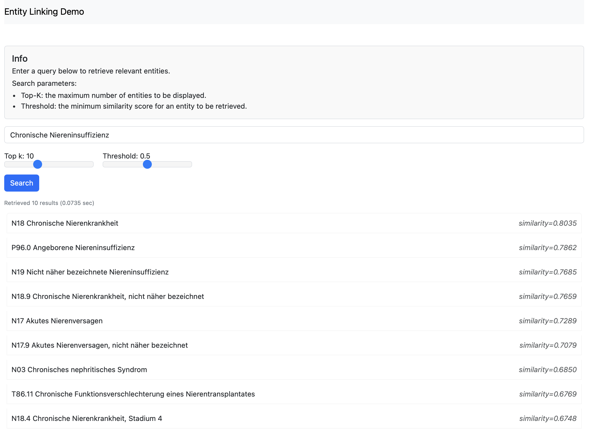

# Entity Linking Dense Retrieval

A demo app for medical entity linking using a custom Transformer model from the [Hugging Face Hub](https://huggingface.co), with PostgreySQL and pgvector for efficient vector retrieval.



## Quick Start

1. **Configure your environment variables:**

   - Copy the example environment file:

     ```bash
     cp .env.example .env
     ```

   - Set the `SEED_PATH` variable in the `.env` file to the location of your data file used for the retrieval process. The file format should be:

     ```json
     {"code": "your_entity_identifier", "concept": "your_entity"}
     ```

## Run in Production Mode

The easiest way to run the project is using Docker Compose in production mode:

1. **Build and start the services:**

   ```bash
    docker-compose build --pull
    docker-compose up -d

2. Check the URL `http://localhost:8000`

To stop the services:
```bash
docker-compose down
```

## Run in Development Mode

For development, you can run just the database in Docker and the application locally:

1. Start the development database:
   ```bash
   docker-compose -f docker-compose.dev.yml up -d
   ```

2. Run the development script:
   ```bash
   chmod +x dev.sh
   ./dev.sh
   ```
   
3. For debug mode with hot reloading:
   ```bash
   ./dev.sh nocors
   ```

4. Check the URL `http://localhost:8000`

To stop the development environment:
```bash
docker-compose -f docker-compose.dev.yml down
```